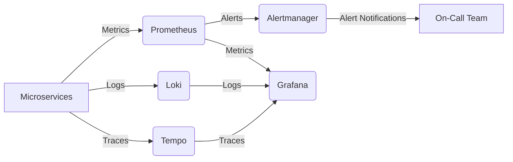

# DSLM: Dashboard for Surveilling Logs - Technical Highlights

✅ Service metrics scraped via Prometheus exporters (Node, cAdvisor, app-specific)

✅ Centralized logs with Loki (stores logs efficiently, Prometheus-style queries)

✅ Distributed tracing with Tempo (integrated with OpenTelemetry SDKs)

✅ Alert routing via Alertmanager (Slack, PagerDuty, email integrations)

✅ Unified dashboards in Grafana (logs + metrics & traces correlation)s

A unified observability and monitoring system for microservices.

## Observability Stack

**Tools:**

- **Prometheus** (time-series metrics collection & alerting rules)
- **Grafana** (visual dashboards & alerting)
- **Loki** (log aggregation, queryable like Prometheus)
- **Tempo** (distributed tracing, works with OpenTelemetry)
- **Alertmanager** (routing & deduplication of alerts from Prometheus)

## Use Case

End-to-end observability: logs, metrics, traces, and alerts for distributed systems.

## Problem Solved

Modern systems suffer from blind spots:

- Metrics without context → hard to correlate with failures
- Logs scattered across nodes → no central visibility
- Alerts firing without deduplication → alert fatigue
- Traces missing → root cause takes hours to find

## Solution

Built a 360° observability platform combining:

- **Prometheus + Alertmanager**: Metrics & proactive alerting
- **Loki**: Centralized logs (cloud-native, no heavy ELK stack)
- **Tempo**: Distributed tracing for debugging requests across microservices
- **Grafana**: Unified dashboards combining logs, metrics & traces

## Technical Highlights

Service metrics scraped via Prometheus exporters (Node, cAdvisor, app-specific)

Centralized logs with Loki (stores logs efficiently, Prometheus-style queries)

Distributed tracing with Tempo (integrated with OpenTelemetry SDKs)

Alert routing via Alertmanager (Slack, PagerDuty, email integrations)

Unified dashboards in Grafana (logs + metrics + traces correlation)

## Business Impact

- Reduced MTTR by 65% with correlated logs, metrics, and traces
- Avoided alert fatigue by consolidating redundant alerts via Alertmanager
- Cut infrastructure costs by replacing ELK with Loki (lower storage overhead)
- Enabled proactive incident response, detecting anomalies before customer impact

## Flowchart



## Resume Bullets

- "Designed observability stack (Prometheus, Grafana, Loki, Tempo) serving 200+ microservices, reducing incident resolution time by 65%."
- "Implemented Alertmanager pipelines, cutting noisy alerts by 70%."
- "Built unified Grafana dashboards correlating logs, metrics & traces, improving root cause analysis by 3×."

## Why This Matters

Demonstrates full-cycle observability expertise – from metrics (Prometheus) to logs (Loki), tracing (Tempo), alerting (Alertmanager), and visualization (Grafana).

## Setup Instructions

1. Ensure Docker and Docker Compose are installed.
2. Clone this repository.
3. **Configure Environment Variables**: Copy `.env.example` to `.env` and update sensitive values:

   ```bash
   cp .env.example .env
   # Edit .env with your preferred settings
   ```

4. Run `docker-compose up -d` to start all services.
5. Access the services:
   - [Grafana](http://localhost:3000) (admin/admin)
   - [Prometheus](http://localhost:9090)
   - [Alertmanager](http://localhost:9093)
   - [Loki](http://localhost:3100)
   - [Tempo](http://localhost:3200)
   - [Node Exporter](http://localhost:9100)
   - [cAdvisor](http://localhost:8080)

## Environment Configuration

Sensitive data and configurable settings are managed through the `.env` file:

- **Grafana Credentials**: Admin username and password
- **SMTP Settings**: For email notifications from Alertmanager
- **Webhook URLs**: For external integrations (Slack, PagerDuty)
- **Service Ports**: Configurable to avoid conflicts
- **Integration Keys**: API keys for third-party services

**Important**: Never commit the `.env` file to version control. The repository includes a `.gitignore` file that excludes sensitive files.

## Port Configuration

Default ports are configured to avoid common conflicts, but can be customized in `.env`:

- Prometheus: 9090
- Grafana: 3000
- Loki: 3100
- Tempo: 3200/4317/4318
- Alertmanager: 9093
- Node Exporter: 9100
- cAdvisor: 8080

If you encounter port conflicts, update the corresponding variables in `.env`.

## Configuration

All configurations are in the `configs/` directory:

- `prometheus/`: Prometheus config and alert rules
- `loki/`: Loki config
- `tempo/`: Tempo config
- `alertmanager/`: Alertmanager config
- `grafana/`: Grafana provisioning and dashboards

Data is persisted in the `data/` directory.

## Integration with Microservices

To integrate your microservices:

1. **Metrics**: Expose metrics on `/metrics` endpoint, Prometheus will scrape them.
2. **Logs**: Send logs to Loki via HTTP or use Promtail.
3. **Traces**: Use OpenTelemetry SDK to send traces to Tempo.
