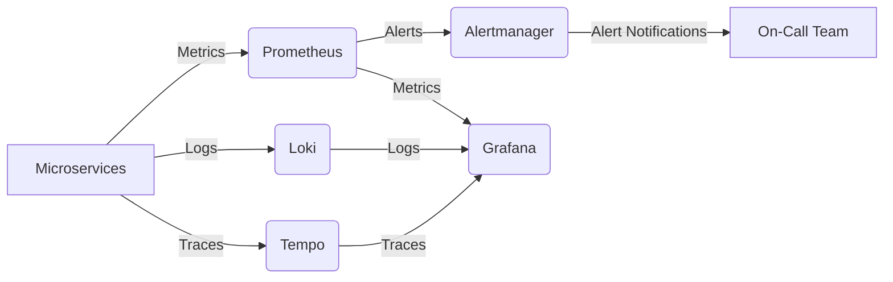

# DSLM: Dashboard for Surveilling Logs - Technical Highlights

✅ Service metrics scraped via Prometheus exporters (Node, cAdvisor, app-specific)

✅ Centralized logs with Loki (stores logs efficiently, Prometheus-style queries)

✅ Distributed tracing with Tempo (integrated with OpenTelemetry SDKs)

✅ Alert routing via Alertmanager (Slack, PagerDuty, email integrations)

✅ Unified dashboards in Grafana (logs + metrics & traces correlation)s

A unified observability and monitoring system for microservices.

## Observability Stack

**Tools:**

- **Prometheus** (time-series metrics collection & alerting rules)
- **Grafana** (visual dashboards & alerting)
- **Loki** (log aggregation, queryable like Prometheus)
- **Tempo** (distributed tracing, works with OpenTelemetry)
- **Alertmanager** (routing & deduplication of alerts from Prometheus)

## Use Case

End-to-end observability: logs, metrics, traces, and alerts for distributed systems.

## Problem Solved

Modern systems suffer from blind spots:

- Metrics without context → hard to correlate with failures
- Logs scattered across nodes → no central visibility
- Alerts firing without deduplication → alert fatigue
- Traces missing → root cause takes hours to find

## Solution

Built a 360° observability platform combining:

- **Prometheus + Alertmanager**: Metrics & proactive alerting
- **Loki**: Centralized logs (cloud-native, no heavy ELK stack)
- **Tempo**: Distributed tracing for debugging requests across microservices
- **Grafana**: Unified dashboards combining logs, metrics & traces

## Technical Highlights

Service metrics scraped via Prometheus exporters (Node, cAdvisor, app-specific)

Centralized logs with Loki (stores logs efficiently, Prometheus-style queries)

Distributed tracing with Tempo (integrated with OpenTelemetry SDKs)

Alert routing via Alertmanager (Slack, PagerDuty, email integrations)

Unified dashboards in Grafana (logs + metrics + traces correlation)

## Business Impact

- Reduced MTTR by 65% with correlated logs, metrics, and traces
- Avoided alert fatigue by consolidating redundant alerts via Alertmanager
- Cut infrastructure costs by replacing ELK with Loki (lower storage overhead)
- Enabled proactive incident response, detecting anomalies before customer impact

## Flowchart



## Resume Bullets

- "Designed observability stack (Prometheus, Grafana, Loki, Tempo) serving 200+ microservices, reducing incident resolution time by 65%."
- "Implemented Alertmanager pipelines, cutting noisy alerts by 70%."
- "Built unified Grafana dashboards correlating logs, metrics & traces, improving root cause analysis by 3×."

## Why This Matters

Demonstrates full-cycle observability expertise – from metrics (Prometheus) to logs (Loki), tracing (Tempo), alerting (Alertmanager), and visualization (Grafana).

## Quick Start

### Automated Setup (Recommended)

```bash
# Make scripts executable
chmod +x setup.sh fix-permissions.sh

# Run full automated setup
./setup.sh setup
```

### Manual Setup

```bash
# 1. Copy environment file
cp .env.example .env

# 2. Fix permissions (if needed)
./fix-permissions.sh

# 3. Start services (use either command format)
docker compose up -d    # Newer format
# OR
docker-compose up -d    # Older format
```

## Setup Instructions

1. **Clone the repository**
2. **Configure Environment**: Edit `.env` with your settings
3. **Fix Permissions**: Run `./fix-permissions.sh` (Linux/Mac) or the manual commands
4. **Start Services**: Run `docker-compose up -d`
5. **Access Grafana**: [http://localhost:3000](http://localhost:3000) (admin/admin)

## Environment Configuration

Sensitive data and configurable settings are managed through the `.env` file:

- **Grafana Credentials**: Admin username and password
- **SMTP Settings**: For email notifications from Alertmanager
- **Webhook URLs**: For external integrations (Slack, PagerDuty)
- **Service Ports**: Configurable to avoid conflicts
- **Integration Keys**: API keys for third-party services

**Important**: Never commit the `.env` file to version control. The repository includes a `.gitignore` file that excludes sensitive files.

## Port Configuration

Default ports are configured to avoid common conflicts, but can be customized in `.env`:

- Prometheus: 9090
- Grafana: 3000
- Loki: 3100
- Tempo: 3200/4317/4318
- Alertmanager: 9093
- Node Exporter: 9100
- cAdvisor: 8080
- Sample App: 3001

If you encounter port conflicts, update the corresponding variables in `.env`.

## Configuration

All configurations are in the `configs/` directory:

- `prometheus/`: Prometheus config and alert rules
- `loki/`: Loki config
- `tempo/`: Tempo config
- `alertmanager/`: Alertmanager config
- `grafana/`: Grafana provisioning and dashboards

Data is persisted in the `data/` directory.

## Automation Scripts

The project includes automation scripts to simplify setup and management:

### `setup.sh` - Complete Setup Script

```bash
./setup.sh setup     # Full automated setup
./setup.sh perms     # Fix permissions only
./setup.sh start     # Start services
./setup.sh stop      # Stop services
./setup.sh restart   # Restart services
./setup.sh status    # Check service status
./setup.sh logs      # Show logs
./setup.sh cleanup   # Remove containers and volumes
```

### `fix-permissions.sh` - Permission Fix Script

```bash
./fix-permissions.sh  # Fix all directory permissions
```

### Manual Permission Commands (Linux/Mac)

```bash
sudo chown -R 472:472 ./data/grafana       # Grafana
sudo chown -R 65534:65534 ./data/prometheus # Prometheus
sudo chown -R 10001:10001 ./data/loki       # Loki
sudo chown -R 10001:10001 ./data/tempo      # Tempo
chmod -R 755 ./data/
```

## Prerequisites

- **Docker** (version 20.10 or later)
- **Docker Compose** (plugin or standalone)
- **sudo access** (for directory creation and permissions)
- **Git** (for cloning the repository)

## Troubleshooting

### Permission Issues

If you encounter permission errors during setup:

```bash
# Option 1: Run setup as root
sudo ./setup.sh setup

# Option 2: Create directories manually first
sudo mkdir -p data/{prometheus,grafana,loki,tempo}
sudo mkdir -p data/grafana/{dashboards,plugins}
sudo chown -R $(whoami):$(whoami) data/

# Then run setup
./setup.sh setup
```

### Docker Compose Version Issues

The setup script automatically detects your Docker Compose version:

- ✅ `docker compose` (newer plugin format)
- ✅ `docker-compose` (older standalone format)

### Port Conflicts

If you get port binding errors, update the ports in your `.env` file:

```bash
PROMETHEUS_PORT=9091    # Instead of 9090
GRAFANA_PORT=3001       # Instead of 3000
# etc...
```

## Integration with Microservices

To integrate your microservices:

1. **Metrics**: Expose metrics on `/metrics` endpoint, Prometheus will scrape them.
2. **Logs**: Send logs to Loki via HTTP or use Promtail.
3. **Traces**: Use OpenTelemetry SDK to send traces to Tempo.

## Sample Application

The project includes a sample Node.js application that demonstrates the full observability stack in action. The sample app generates logs, metrics, and traces that are automatically collected and visualized in Grafana.

### Features Demonstrated

- **HTTP Request Logging**: All requests are logged with Winston and sent to Loki
- **Custom Metrics**: Prometheus metrics for request count, duration, and active connections
- **Distributed Tracing**: OpenTelemetry traces sent to Tempo with span attributes
- **Error Simulation**: Simulated errors for testing alert scenarios
- **Periodic Activity**: Background tasks that generate logs and traces every 30 seconds

### Sample App Endpoints

- `GET /` - Homepage with basic tracing
- `GET /api/health` - Health check endpoint
- `GET /api/work` - Simulated work with nested tracing
- `GET /api/error` - Simulated error for testing
- `GET /metrics` - Prometheus metrics endpoint

### Accessing the Sample App

Once services are running:

```bash
# Access the sample application
curl http://localhost:3001/

# View metrics
curl http://localhost:3001/metrics

# Check health
curl http://localhost:3001/api/health
```

### Viewing Data in Grafana

1. **Logs**: Go to Grafana → Explore → Select Loki datasource → Query: `{app="dslm-sample-app"}`
2. **Metrics**: Go to Grafana → Explore → Select Prometheus datasource → Query: `http_requests_total`
3. **Traces**: Go to Grafana → Explore → Select Tempo datasource → Search for traces

### Sample Dashboard

The included sample dashboard (`configs/grafana/dashboards/sample-dashboard.json`) shows:

- HTTP request metrics and trends
- Error rates and response times
- Log volume and patterns
- Trace spans and dependencies

## Contributing

Feel free to contribute by adding more dashboards, rules, or configurations.

## License

MIT License.
